# Gói Bằng Chứng Tuần 6 — Kiểm Soát Vận Hành TaskIO

## Tóm Tắt Dự Án

TaskIO là một ứng dụng quản lý công việc và workspace theo hướng Trello-style, phục vụ nghiệp vụ cộng tác quản lý dự án. Người dùng có thể tạo workspace, board, column, card, task, comment, member và attachment. Ngoài phần quản lý task truyền thống, ứng dụng còn có lớp AI hỗ trợ hỏi đáp tài liệu sản phẩm và tạo tóm tắt workspace.

Kiến trúc được kế thừa từ W1-W5 là mô hình three-tier application: React frontend, backend Express/Socket.IO, MongoDB/DocumentDB làm data store chính, Redis/ElastiCache cho cache và realtime coordination, S3 cho artifact/attachment, và một lớp AI dùng Bedrock. Ở W5, nhóm đã bổ sung phần AWS networking và resilience gồm VPC peering, network segmentation, API Gateway trước Lambda, VPC Flow Logs, EFS workspace exports, AWS Backup và async Lambda failure handling.

Sang W6, nhóm không triển khai lại toàn bộ kiến trúc W1-W5 vì mục tiêu tuần này là chứng minh các kiểm soát vận hành. Hạ tầng demo được giữ tối giản: triển khai một AZ khi có thể, ưu tiên serverless cho luồng AI/API, và chỉ giữ EC2 nhỏ ở những chỗ cần bằng chứng thật. Nhóm không dùng NAT Gateway, Network Firewall, mở rộng multi-AZ hoặc database replica bổ sung vì các thành phần đó không bắt buộc cho yêu cầu W6 và sẽ làm tăng chi phí mà không giúp bằng chứng rõ hơn.

Nhóm cũng xử lý hai góp ý từ W5. Thứ nhất, bằng chứng W5 từng làm lộ access key, nên quy trình triển khai W6 chỉ load credential từ file CSV local lúc chạy, không hardcode key vào script hoặc tài liệu. Gói bằng chứng cũng được scan lại trước khi nộp để tránh chứa access key/secret pattern. Thứ hai, W5 dùng nhiều hạ tầng hơn mức demo cần, nên W6 chọn hướng triển khai tối giản: chỉ triển khai những thành phần cần để chứng minh bốn kiểm soát vận hành, và không thêm dịch vụ mới nếu dịch vụ đó không trực tiếp làm bằng chứng mạnh hơn.

## Báo Cáo Chung

Công việc tuần này được chia thành ba nhóm chính. Nam, Khanh và Hoàng phụ trách phát triển và triển khai. Tiến, Quyết và Hưng chuẩn bị phần trình bày và slide. Thương, Nghĩa và Khôi phụ trách gói bằng chứng và sơ đồ kiến trúc.

Stack W6 hiện tại đủ để demo yêu cầu của tuần này dù không phải là bản production đầy đủ của W1-W5. W6 được chấm trên bốn nhóm kiểm soát vận hành: hiển thị chi phí, hành động chi phí tự động, khả năng quan sát và bảo mật tự phục hồi. Stack hiện có EC2, ALB, Lambda, API Gateway, CloudWatch Logs, CloudTrail, S3, SNS và EventBridge. Các thành phần này đủ để tạo bằng chứng thật cho bốn nhóm bắt buộc mà không cần mở rộng thêm hạ tầng tốn chi phí.

Trong lần rà soát chi phí đầu tiên, nhóm cũng phát hiện một nguồn chi phí OpenSearch Serverless có sẵn trong tài khoản workshop. Phát hiện này được đưa vào báo cáo vì nó thể hiện nhóm có điều tra khoản chi bất thường trên AWS, thay vì chỉ báo cáo các resource do nhóm chủ động triển khai.

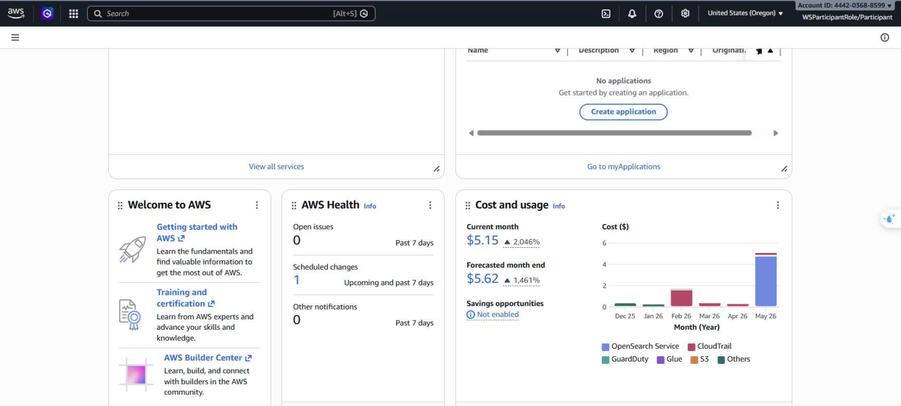

*Hình 1. Cost Explorer cho thấy khoảng 5 USD chi phí OpenSearch đã tồn tại trong tài khoản workshop trước khi TaskIO W6 được triển khai.*

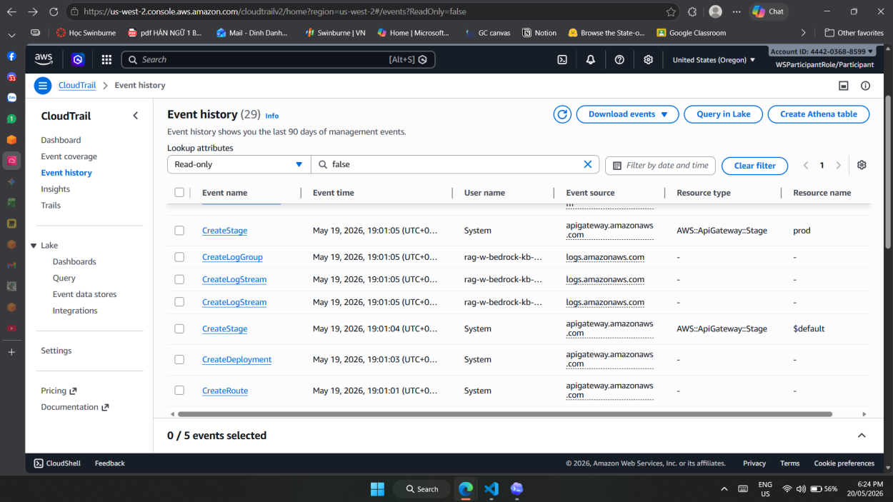

*Hình 2. Bằng chứng CloudTrail logging cho thấy hoạt động trong tài khoản đang được ghi lại để phục vụ audit và điều tra.*

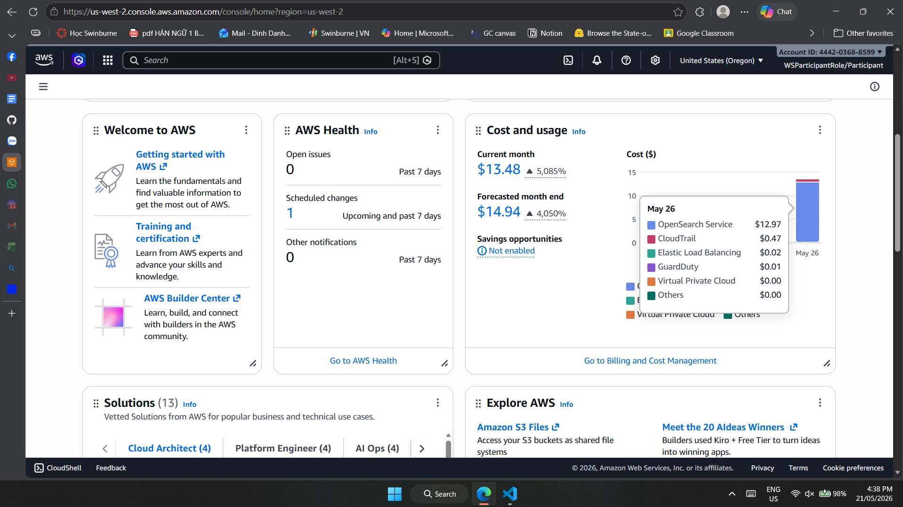

*Hình 3. Lần kiểm tra cost thứ hai cho thấy chi phí OpenSearch tăng lên gần 13 USD trong region us-west-2.*

## Phát Hiện Chi Phí OpenSearch

Trong quá trình điều tra chi phí, nhóm phát hiện khoản phí bất thường chủ yếu đến từ một OpenSearch Serverless vector collection ở `us-west-2`. Resource này không thuộc stack TaskIO W6. Nó nằm trong stack `rag-w-bedrock-kb` và có vẻ liên quan đến môi trường RAG của workshop.

| Trường | Giá trị |
|---|---|
| Region | `us-west-2` |
| Service | Amazon OpenSearch Service |
| Type | OpenSearch Serverless `VECTORSEARCH` |
| Collection | `myproduct-kb` |
| Collection ID | `mgqs44w2nticsbztifo2` |
| Stack | `rag-w-bedrock-kb` |
| Initial status | `ACTIVE` |
| Standby replicas | `ENABLED` |

Cost Explorer cho thấy chi phí đến từ lượng sử dụng OCU của OpenSearch Serverless:

```text
2026-05-19 -> 2026-05-20
USW2-IndexingOCU: 2.6453 USD
USW2-SearchOCU:   2.6450 USD
Total:            5.2903 USD

2026-05-20 -> 2026-05-21
USW2-IndexingOCU: 3.8400 USD
USW2-SearchOCU:   3.8400 USD
Total:            7.6800 USD

Tổng quan sát:   ~12.97 USD
```

Điểm đáng chú ý là OpenSearch Serverless tính phí theo OCU-hours cho cả indexing capacity và search capacity. Một vector collection vẫn có thể tạo baseline cost kể cả khi ứng dụng không query nhiều. Vì collection này không cần cho demo TaskIO W6, nhóm đã xóa collection do CloudFormation quản lý để dừng phần OCU-hour spend đang tiếp tục phát sinh.

Tóm tắt xác minh:

```text
CloudFormation stack: rag-w-bedrock-kb
Resource đã xóa:     AWS::OpenSearchServerless::Collection
Kết quả xóa:        DELETE_COMPLETE

Kiểm tra sau cleanup:
aws opensearchserverless list-collections --region us-west-2
Kết quả: []
```

Phát hiện này củng cố hướng vận hành tiết kiệm chi phí của W6: xác định nguồn chi phí, kiểm tra nó có thuộc workload đang sử dụng hay không, và loại bỏ nếu nó nằm ngoài phạm vi demo bắt buộc.

## MH-COST-V — Hiển Thị Và Phân Bổ Chi Phí

### Mục tiêu

MH-COST-V thiết lập khả năng nhìn thấy và phân bổ chi phí cơ bản cho TaskIO trên AWS. Nhóm đã triển khai chiến lược tagging thống nhất, xác minh tag trên resource đã triển khai, cấu hình theo dõi chi phí và ghi nhận giới hạn billing khiến workshop member account không thể tự kích hoạt custom cost allocation tags.

### Chiến Lược Tagging

Chiến lược tagging của TaskIO được thiết kế cho toàn bộ ứng dụng full-stack, không chỉ các resource được triển khai trong W6. Theo AWS tagging best practices, nhóm tách tag theo bốn mục đích: phân bổ chi phí, tự động hóa, tổ chức resource và kiểm soát bảo mật/truy cập. W6 chỉ triển khai một subset tối thiểu để tạo bằng chứng, nhưng cùng một bộ tag chuẩn sẽ áp dụng cho full stack khi bật lại các thành phần W1-W5 như ALB/ASG, EFS, Backup, Network Firewall, NAT, DocumentDB, ElastiCache, S3 attachment bucket và API/Lambda layer.

Các tag bắt buộc:

| Tag key | Mục đích | Giá trị chuẩn |
|---|---|---|
| `Application` | Xác định workload và nhóm trong Cost Explorer | `TaskIO` |
| `Environment` | Xác định môi trường và làm bộ lọc cho automation | `dev`, `staging`, hoặc `prod` |
| `CostCenter` | Phân bổ chi phí / showback | `G11` |
| `Owner` | Người/nhóm chịu trách nhiệm | `dinhdanhnam1@gmail.com` |
| `ManagedBy` | Công cụ hoặc cách quản lý triển khai | `cloudformation`, `manual-demo`, hoặc `terraform` |

Các tag phục vụ automation:

| Tag key | Giá trị cho phép | Ý nghĩa |
|---|---|---|
| `keep` | `true` | Cost Guard không được dừng resource này |
| `SecurityGuardScope` | `true` | Security Guard được phép xử lý ingress admin public không an toàn |
| `CostGuardScope` | `true` | Resource đủ điều kiện để Cost Guard xử lý tự động |

Quy tắc tag:

- Tag có phân biệt chữ hoa/thường. Dùng `Application=TaskIO`, không dùng `taskIO`, `taskio` hoặc `Taskio`.
- Dùng `Environment=dev`, không dùng `Dev` hoặc `DEV`.
- Dùng một contact `Owner` chung, tránh mỗi resource một giá trị cá nhân khác nhau.
- Gắn tag ngay lúc tạo resource bằng CloudFormation/IaC nếu có thể; chỉ dùng Tag Editor để audit hoặc sửa thiếu sót.
- Activate `Application`, `Environment`, `CostCenter` và `Owner` làm cost allocation tags ở payer account trước khi phụ thuộc vào Cost Explorer group theo tag.

Phạm vi áp dụng cho full stack:

| Lớp | Loại resource | Tag bắt buộc | Ghi chú automation |
|---|---|---|---|
| Frontend/static | S3 frontend bucket, CloudFront distribution, Route 53 records | Tag bắt buộc | Không cần `keep`; Cost Guard không stop nhóm này |
| API edge | ALB, target groups, API Gateway REST/HTTP APIs, WAF nếu bật | Tag bắt buộc | ALB dev có thể đưa vào policy scale-down sau này, nhưng Cost Guard W6 chỉ dừng EC2 |
| Compute | EC2, ASG, ECS/Fargate nếu có, Lambda | Tag bắt buộc | Backend compute cần chạy lâu dùng `keep=true`; demo mục tiêu dừng thì không |
| Data | DocumentDB/Mongo, ElastiCache/Redis, EFS, S3 attachment bucket | Tag bắt buộc | Không dừng/xóa data store bằng Cost Guard W6; policy sau này cần kiểm tra backup/snapshot |
| Network | VPC, subnets, route tables, NAT Gateway, Network Firewall, security groups, VPC endpoints | Tag bắt buộc | NAT/Firewall tốn chi phí nên cần tag để phân bổ chi phí, không đưa vào tự động dừng trong W6 |
| Resilience | AWS Backup vault/plans, SQS DLQ, CloudWatch alarms/log groups | Tag bắt buộc | Giữ để bằng chứng audit/restore; không phải mục tiêu dừng của Cost Guard |
| Operations | Cost Guard Lambda, Security Guard Lambda, EventBridge rules, SNS, Budget | Tag bắt buộc | Các control này nên có `keep=true` vì chúng bảo vệ environment |

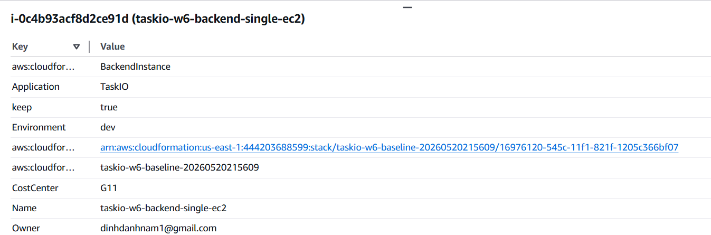

*Hình 4. Bằng chứng Tag Editor cho backend EC2 của TaskIO với bộ tag chuẩn của Week 6.*

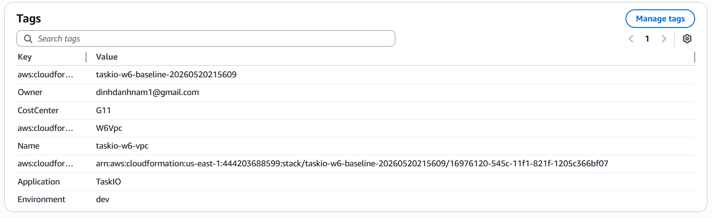

*Hình 5. Bằng chứng Tag Editor cho VPC của TaskIO với cùng chiến lược tagging đã chuẩn hóa.*

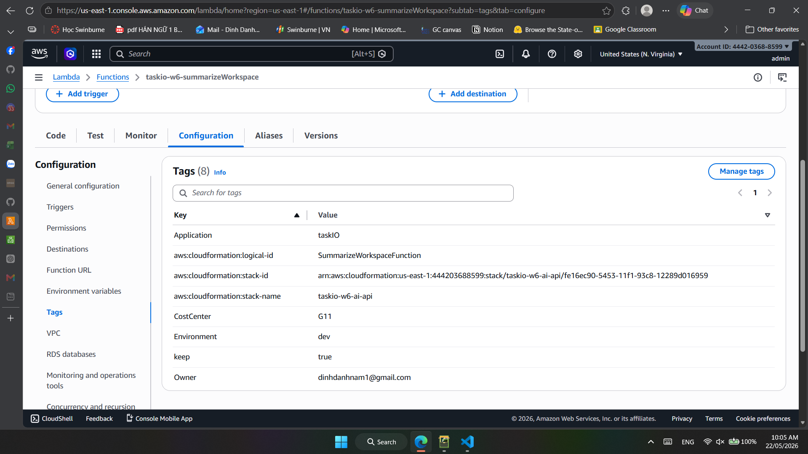

*Hình 5a. Bằng chứng tag cho Lambda `taskio-w6-summarizeWorkspace`, bổ sung loại resource thứ ba ngoài EC2 và VPC.*

Các resource nền tảng đã được tag gồm VPC, Internet Gateway, public subnet, route table, security groups, EC2 instances, Systems Manager Parameter Store, Application Load Balancer, target group và listener. Với triển khai full-stack, tagging sẽ mở rộng sang S3, CloudFront, API Gateway, Lambda, EFS, Backup, NAT Gateway, Network Firewall, DocumentDB và ElastiCache nếu các thành phần này được bật lại.

Trong môi trường workshop, mức tuân thủ được xác minh thủ công qua AWS Resource Groups Tag Editor. Nếu đưa sang môi trường production, tagging nên được enforce theo hai lớp:

- Proactive: CloudFormation tags as code, AWS Organizations Tag Policies, CloudFormation Guard/hooks, và SCP guardrails cho request tạo resource thiếu tag.
- Reactive: AWS Config `required-tags`, Tag Editor audit, và Lambda remediation hoặc ticketing cho resource thiếu tag.

### Cost Allocation Tags

Nhóm đã thử kích hoạt custom cost allocation tags trong AWS Billing Console. Tuy nhiên tài khoản workshop là AWS Organizations member account, nên quyền billing bị giới hạn ở cấp payer account. Vì vậy nhóm không thể kích hoạt custom cost allocation tags trực tiếp từ sandbox account. Trainer đã chấp nhận giới hạn này sau khi nhóm giải thích rằng activation phải được thực hiện ở payer/management account, không phải từ member account dùng cho workshop. Vì breakdown Cost Explorer theo tag chưa khả dụng trong sandbox, bằng chứng dùng breakdown theo service trong Cost Explorer làm fallback và vẫn giữ chiến lược tagging để khi payer account activate tags thì workload có thể được group theo Application, Environment, CostCenter và Owner ngay lập tức.

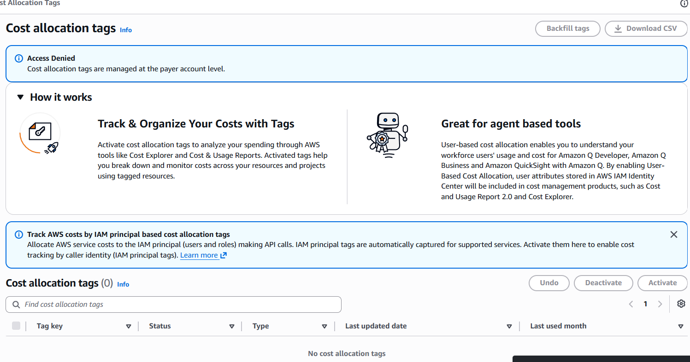

*Hình 6. Giới hạn Billing Console cho thấy cost allocation tags phải được quản lý ở cấp payer account, không phải từ workshop member account.*

### Công Cụ Theo Dõi Chi Phí

AWS Cost Explorer được dùng để rà soát chi phí theo service và xu hướng chi phí baseline. Việc group chi phí theo tag chưa khả dụng vì member account không có quyền kích hoạt custom cost allocation tags, và giới hạn này đã được trainer chấp nhận. AWS Budgets được cấu hình theo hai lớp: cảnh báo monthly cho owner để theo dõi spending tổng thể, và daily budget phục vụ automation theo tín hiệu chi phí để nối vào đường đi SNS -> Cost Guard Lambda.

| Cấu hình | Giá trị |
|---|---|
| Tên monthly budget | `TaskIO-W6-Budget` |
| Ngưỡng monthly budget | `150 USD` |
| Chu kỳ monthly budget | Monthly |
| Loại cảnh báo monthly | Actual and Forecasted |
| Email nhận cảnh báo | `dinhdanhnam1@gmail.com` |
| Tên daily budget cho Cost Guard | `TaskIO-W6-Daily-Cost-Guard` |
| Ngưỡng daily budget cho Cost Guard | `150 USD` |
| Chu kỳ daily budget cho Cost Guard | Daily |
| Đường đi action của daily budget | SNS topic `healthbot-cost-guard-alerts` -> Lambda `costGuardLambda` |

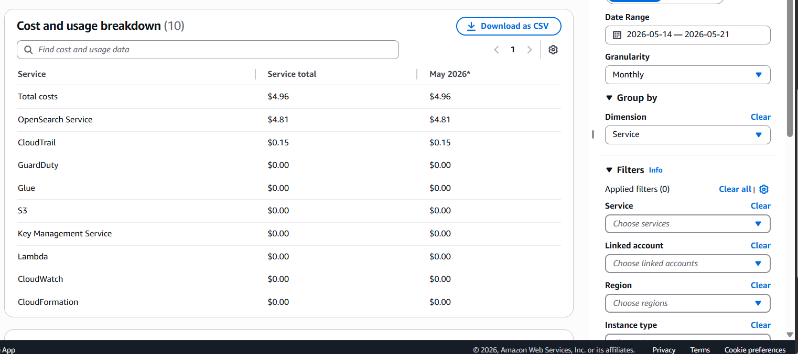

*Hình 7. Cost Explorer service breakdown dùng để xác định nguồn chi phí chính trong AWS account.*

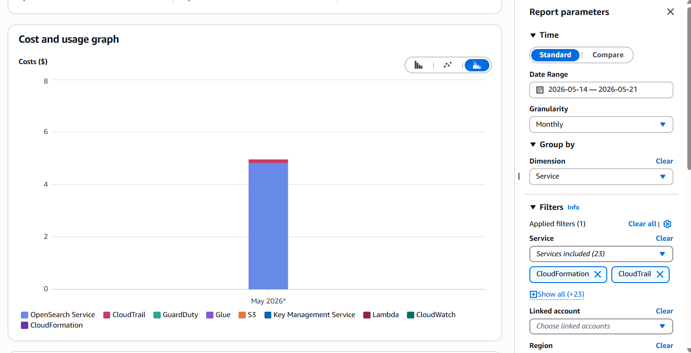

*Hình 8. Biểu đồ xu hướng Cost Explorer dùng để so sánh spending trong giai đoạn quan sát Week 6.*

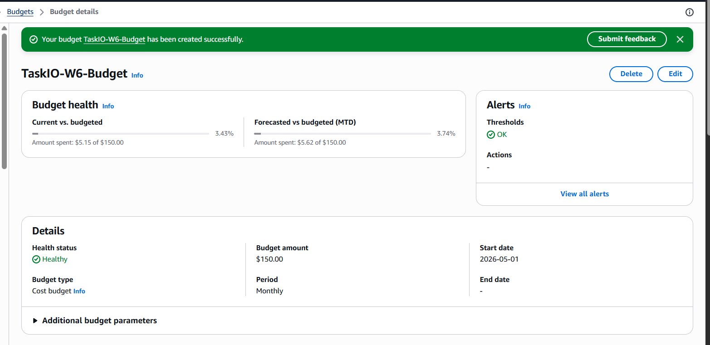

*Hình 9. Cấu hình AWS Budget cho TaskIO-W6-Budget với threshold 150 USD. Daily budget `TaskIO-W6-Daily-Cost-Guard` cũng đã được tạo để nối tín hiệu chi phí vào SNS -> Cost Guard path.*

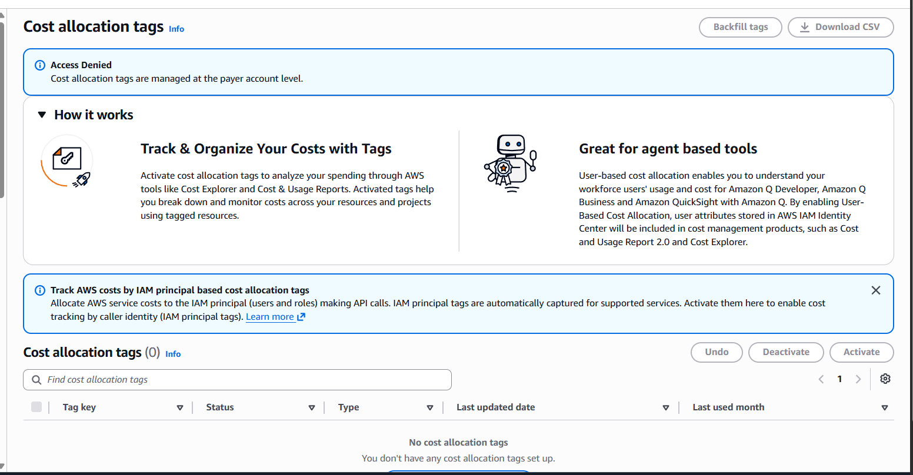

*Hình 10. Lần thử kích hoạt cost allocation tag bị chặn bởi quyền billing của tài khoản workshop.*

### Kết quả

MH-COST-V đã hoàn thành trong phạm vi W6. Nhóm có chiến lược tagging nhất quán, bằng chứng xác minh tag resource, bằng chứng Cost Explorer, theo dõi Budget và bằng chứng về giới hạn billing permission.

## MH-COST-A — Kiểm Soát Chi Phí Và Hành Động Tự Động

MH-COST-A yêu cầu một hành động kiểm soát chi phí tự động, không chỉ dừng ở mức thông báo. Nhóm triển khai Cost Guard Lambda có khả năng dừng W6 EC2 instance khi được trigger. Cách này phù hợp với hạ tầng tối giản vì EC2 là compute resource rõ ràng, có thể kiểm soát được, và hành động có thể được xác minh qua EC2 state cùng CloudTrail events.

Lambda sử dụng IAM role theo hướng least privilege cho quy trình dừng EC2. EventBridge cung cấp lịch chạy tự động, còn đường đi Budget -> SNS -> Lambda chứng minh cùng cơ chế tự động này có thể được nối với tín hiệu chi phí.

Policy Cost Guard cho full stack:

| Nhóm resource | Hành động trong demo W6 | Hành động khi triển khai full stack |
|---|---|---|
| Standalone dev EC2 | Stop nếu `Environment=dev` và không có `keep=true` | Dùng cùng policy; phù hợp cho demo host, bastion/debug host và temporary worker |
| Backend EC2 cần chạy liên tục | Gắn `keep=true` | Bỏ qua hành động stop; review thủ công hoặc scale qua ASG policy |
| Backend do ASG quản lý | Không dùng làm mục tiêu dừng W6 | Không stop instance trực tiếp; chỉ scale `MinSize` và `DesiredCapacity` về `0` cho ASG dev/non-critical có `CostGuardScope=true` |
| ECS/Fargate services | Không triển khai trong W6 | Hành động tương lai là scale down desired count, không terminate task trực tiếp, và chỉ ngoài production |
| NAT Gateway / Network Firewall | Không triển khai trong W6 | Tag để phân bổ chi phí; không auto-delete trong W6 vì xóa sẽ thay đổi routing/security posture |
| DocumentDB / ElastiCache / EFS | Không triển khai trong W6 | Loại khỏi tự động dừng trong W6; policy tương lai cần snapshot/backup và maintenance window rõ ràng |
| Lambda / API Gateway / CloudWatch / SNS / EventBridge | Giữ chạy | Không stop; đây là control chi phí thấp hoặc bề mặt observability |

Trong account hiện tại, resource cần `keep=true` là backend instance đang chạy `taskio-w6-backend-single-ec2`. Demo instance được cố ý để không có `keep=true` để Cost Guard tạo bằng chứng `StopInstances` rõ ràng. Cách này giữ demo W6 đơn giản, đồng thời vẫn tài liệu hóa cách cùng một mô hình tag bảo vệ hoặc kiểm soát resource của full stack sau này.

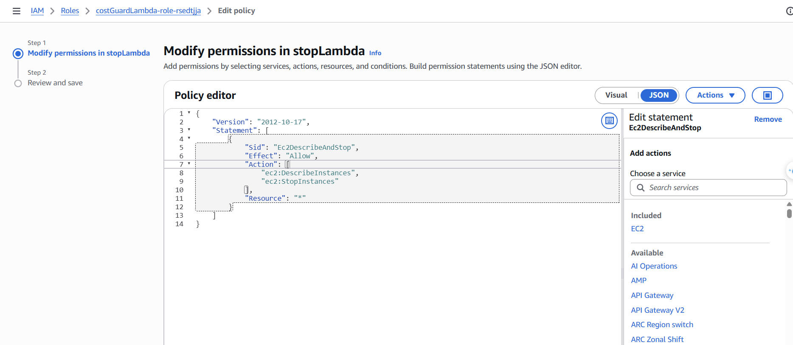

*Hình 11. Bằng chứng IAM role của Cost Guard Lambda cho permission least-privilege dùng cho automation dừng EC2.*

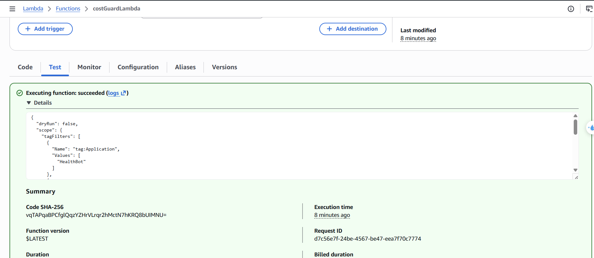

*Hình 12. Test Cost Guard Lambda thủ công trả về success và trigger đường dừng EC2.*

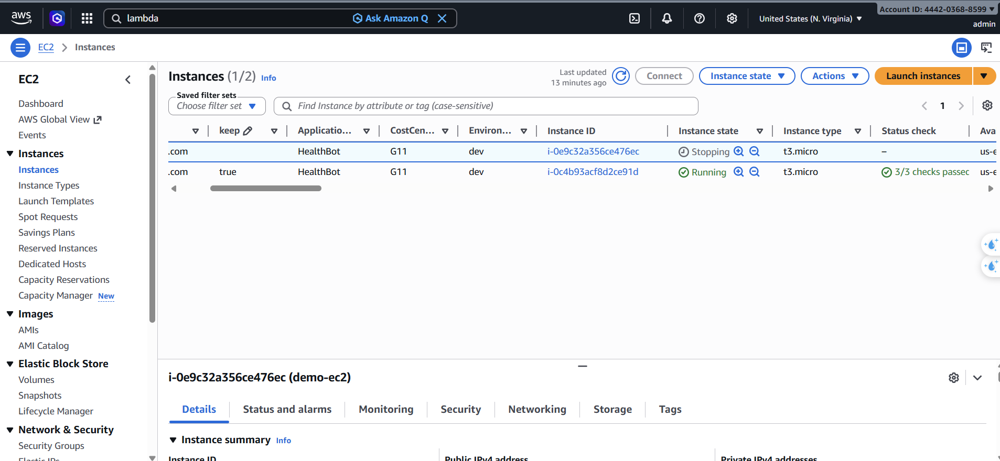

*Hình 13. Bằng chứng EC2 console cho thấy instance mục tiêu chuyển sang stopping/stopped sau automation.*

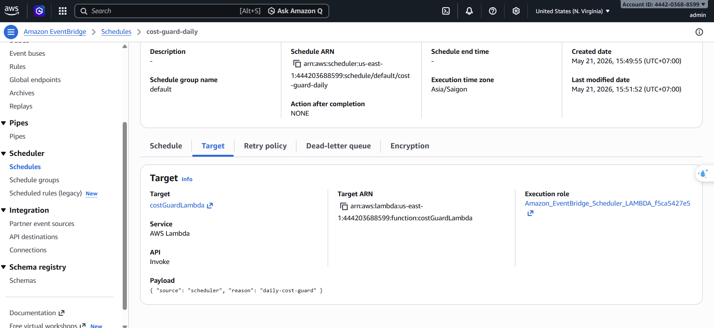

*Hình 14. EventBridge daily schedule được cấu hình để tự động invoke Cost Guard Lambda.*

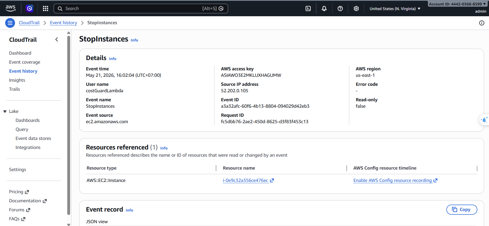

*Hình 15. Bằng chứng CloudTrail event cho hành động dừng EC2 được tạo bởi quy trình Cost Guard.*

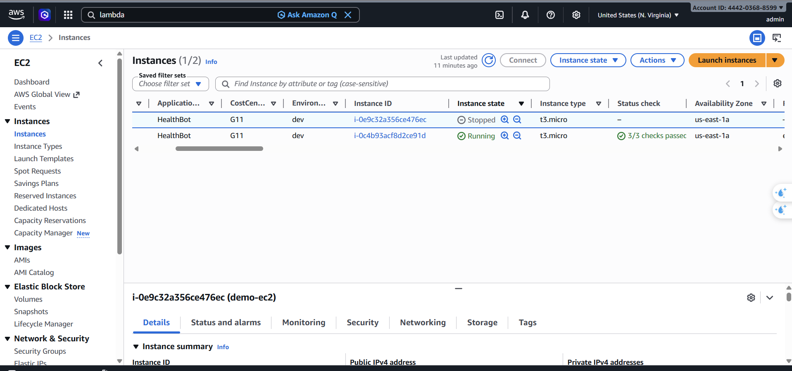

*Hình 16. Bằng chứng trạng thái EC2 instance xác nhận Week 6 demo instance đã được dừng bởi control.*

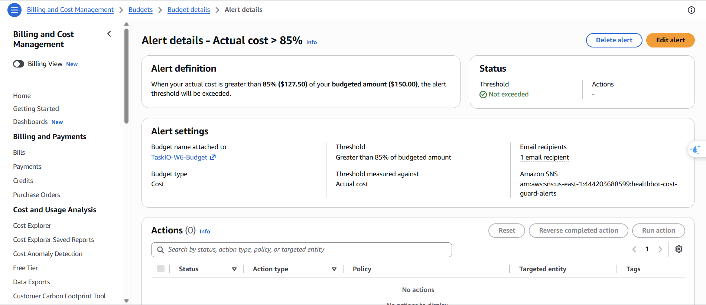

*Hình 17. Đường đi AWS Budget -> SNS -> Lambda theo tín hiệu chi phí được cấu hình cho phản ứng chi phí tự động.*

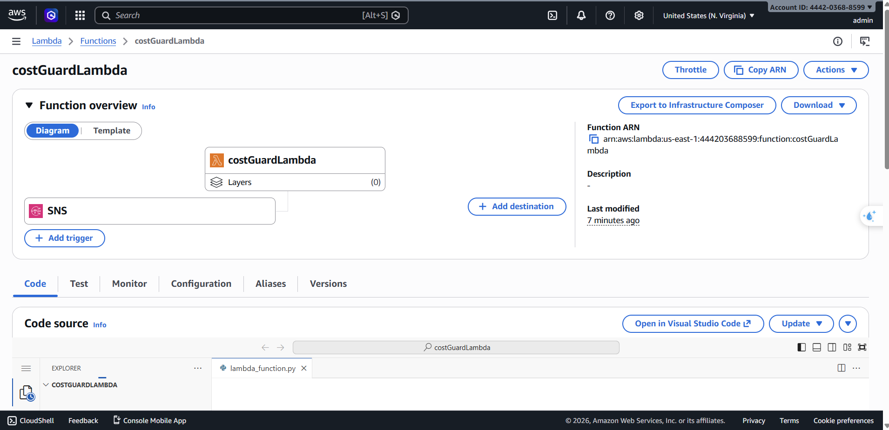

*Hình 18. Bằng chứng SNS topic/subscription cho đường thông báo kết nối đến Cost Guard Lambda.*

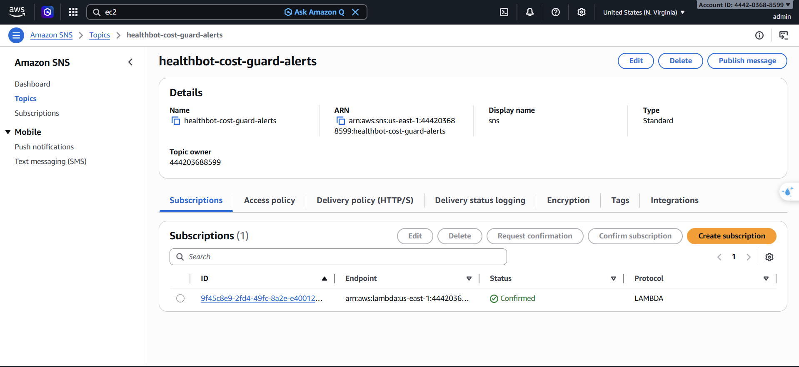

*Hình 19. Bằng chứng test SNS publish cho thấy đường thông báo chi phí có thể trigger automation phía sau.*

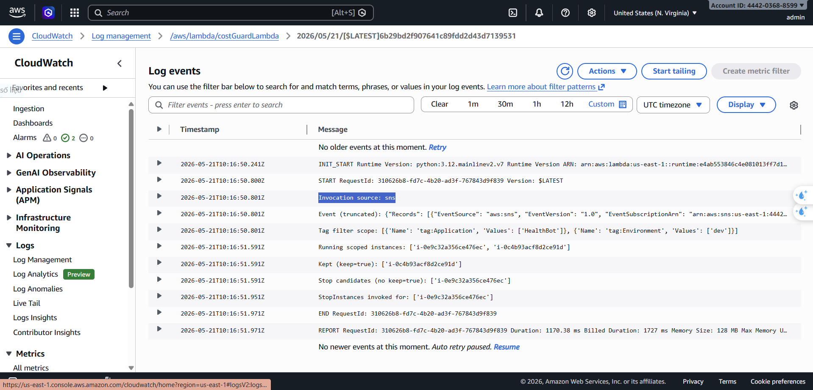

*Hình 20. Bằng chứng tích hợp Cost Guard cuối cùng cho Budget, SNS và response flow của Lambda.*

### ADR Về Độ Trễ Dữ Liệu Chi Phí

Dữ liệu chi phí AWS không realtime. Cost Explorer và AWS Budgets có thể trễ khoảng 8-24 giờ, nên daily budget mới tạo có thể chưa kịp vượt ngưỡng hoặc publish thông báo vượt ngưỡng chi phí thật trong thời gian demo workshop ngắn. Với môi trường production, TaskIO vẫn giữ daily budget thật nối với SNS và Cost Guard; còn trong demo, nhóm dùng publish SNS thủ công để chứng minh cùng một đường xử lý phía sau. Cách này tránh phải chờ dữ liệu billing bị trễ nhưng vẫn chứng minh được phản ứng vận hành: tín hiệu chi phí -> SNS -> Cost Guard Lambda -> hành động dừng EC2 -> bằng chứng CloudTrail.

Hành vi trong production được thiết kế thận trọng: Cost Guard W6 chỉ dừng compute độc lập ngoài production khi resource có `Environment=dev`, đủ điều kiện cost action và không được bảo vệ bởi `keep=true`. Với ASG/ECS/database, policy production nên dùng scale-down, snapshot/backup hoặc maintenance window thay vì hành vi dừng/xóa có rủi ro.

## MH-OBS — Khả Năng Quan Sát

Phạm vi quan sát của TaskIO W6 tập trung vào luồng AI/API đã triển khai lại, vì đây là luồng nghiệp vụ người dùng nhìn thấy có giá trị nhất trong hạ tầng tối giản. Dashboard kết hợp telemetry cấp ứng dụng, metric của managed service và metric cấp host để nhóm kiểm tra được luồng AI có truy cập được không, Lambda có healthy không, và demo host có basic disk telemetry không.

Custom metric bắt buộc được phát sinh từ mã ứng dụng, không phải push thủ công bằng CLI. Lambda `askDocsBot` publish `AskDocsLatencyMs` và `AskDocsErrorCount` vào namespace `TaskIO/Operations`. Lambda `summarizeWorkspace` cũng publish `WorkspaceSummaryLatencyMs` và `WorkspaceSummaryErrorCount` khi luồng summary chạy hoặc gặp lỗi. Các metric hiện đang dùng dimensions `Application=TaskIO`, `Environment=dev` và `Function=askDocsBot` hoặc `Function=summarizeWorkspace`, giúp dashboard được scope đúng vào TaskIO workload.

Phần quan sát API Gateway được bổ sung với chi phí thấp. W6 REST API `taskio-w6-ai-rest-api` đã bật stage-level access logging vào `/aws/rest-api/taskio-w6-ai-rest-api`, bật method metrics, và có saved Logs Insights query để aggregate request theo status, method và path. Để tạo datapoint cho dashboard, nhóm đã gọi `OPTIONS /ai/docs/ask` và `OPTIONS /ai/workspaces/{workspaceId}/summary` nhiều lần; access log ghi nhận status `200` cho cả hai route.

Bằng chứng cho saved Logs Insights query:

| Trường | Giá trị |
|---|---|
| Tên saved query | `W6-TaskIO-ApiGateway-Requests-By-Status` |
| Tên saved query | `W6-TaskIO-ApiGateway-Recent-Raw-Rows` |
| Log group | `/aws/rest-api/taskio-w6-ai-rest-api` |
| Mục đích query | Aggregate request API Gateway theo status/method/path và hiển thị các dòng request gần nhất |

Query text cho các dòng request gần nhất:

```sql
fields @timestamp, @message
| sort @timestamp desc
| limit 20
```

Các dòng kết quả quan sát được từ `/aws/rest-api/taskio-w6-ai-rest-api`:

| Thời gian UTC | Method | Path | Status |
|---|---|---|---|
| `2026-05-22 01:44:49` | POST | `/ai/workspaces/{workspaceId}/summary` | 500 |
| `2026-05-22 01:44:48` | POST | `/ai/workspaces/{workspaceId}/summary` | 500 |
| `2026-05-22 01:44:47` | POST | `/ai/workspaces/{workspaceId}/summary` | 500 |
| `2026-05-22 01:44:46` | POST | `/ai/workspaces/{workspaceId}/summary` | 500 |
| `2026-05-22 01:44:45` | POST | `/ai/workspaces/{workspaceId}/summary` | 500 |
| `2026-05-22 01:44:44` | POST | `/ai/workspaces/{workspaceId}/summary` | 500 |

Phần này đáp ứng yêu cầu saved query: có tên query rõ ràng, log group rõ ràng, và hơn 5 dòng kết quả từ access log thật của API Gateway.

| Lớp | Tín hiệu | Nguồn |
|---|---|---|
| Application | `TaskIO/Operations / AskDocsLatencyMs` | `askDocsBot` Lambda code qua `PutMetricData` |
| Application | `TaskIO/Operations / AskDocsErrorCount` | `askDocsBot` Lambda error path |
| Application | `TaskIO/Operations / WorkspaceSummaryLatencyMs` | `summarizeWorkspace` Lambda code qua `PutMetricData` |
| Application | `TaskIO/Operations / WorkspaceSummaryErrorCount` | `summarizeWorkspace` Lambda error path |
| Lambda runtime | `Errors` | AWS/Lambda standard metric |
| Lambda runtime | `Duration` | AWS/Lambda standard metric |
| API edge | `Count` | AWS/ApiGateway standard metric cho `taskio-w6-ai-rest-api` |
| Host | `disk_used_percent` | CloudWatch Agent `CWAgent` namespace |

Cách implement custom metric:

```js
await cloudWatchClient.send(new PutMetricDataCommand({
  Namespace: 'TaskIO/Operations',
  MetricData: [{
    MetricName: 'AskDocsLatencyMs',
    Value: Date.now() - startedAt,
    Unit: 'Milliseconds',
    Dimensions: [
      { Name: 'Application', Value: 'TaskIO' },
      { Name: 'Environment', Value: 'dev' },
      { Name: 'Function', Value: 'askDocsBot' }
    ]
  }]
}))
```

Execution role của Lambda chỉ cho phép `cloudwatch:PutMetricData` trong namespace `TaskIO/Operations`. Cách này giữ permission đúng phạm vi custom metric namespace dùng cho W6 dashboard.

Sau khi invoke để tạo dữ liệu demo, CloudWatch đã có datapoint cho cả hai Lambda:

```text
AskDocsLatencyMs:              5 samples, average ~116.8 ms
AskDocsErrorCount:             sum 5
WorkspaceSummaryLatencyMs:     5 samples, average ~150 ms
WorkspaceSummaryErrorCount:    sum 5
```

Lưu ý: chiến lược tagging chuẩn hóa Application=TaskIO. Dimension của custom metric trong CloudWatch cũng dùng Application=TaskIO, nên dashboard và bằng chứng nên chọn cùng dimension này để tránh lệch scope.

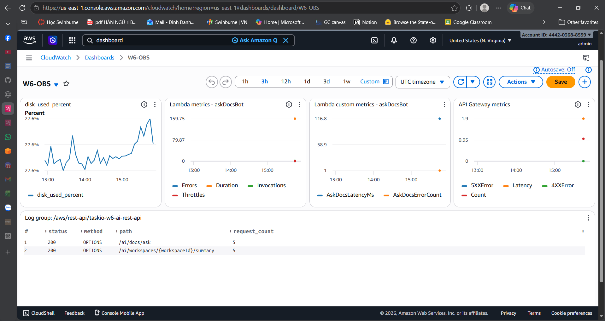

*Hình 21. CloudWatch dashboard tổng quan cho MH3, gom các TaskIO widget quan sát vào một màn hình.*

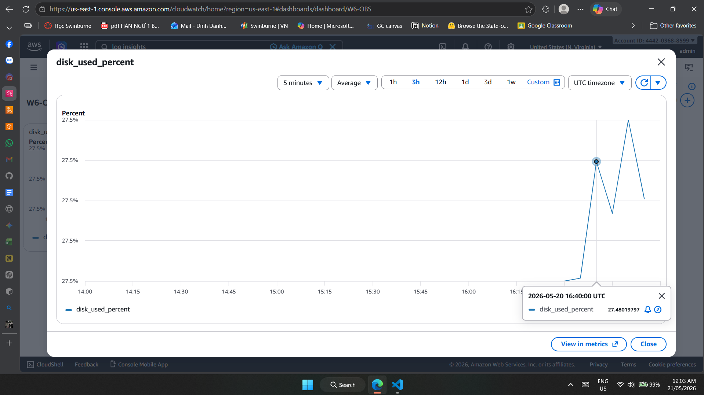

*Hình 22. CloudWatch dashboard widget cho API Gateway request metric của TaskIO AI REST API.*

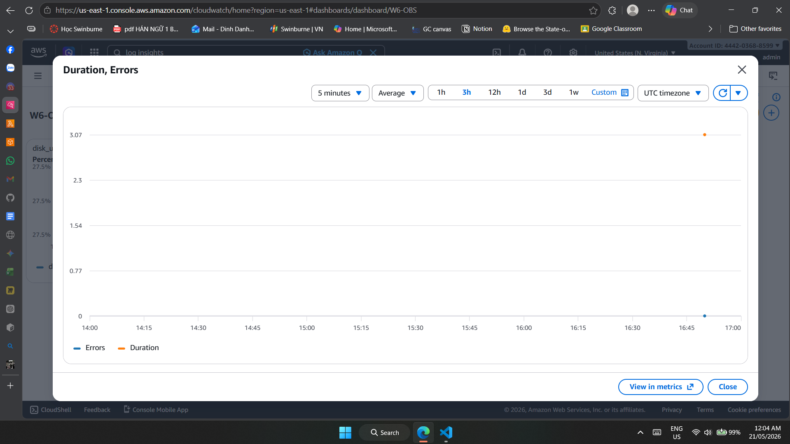

*Hình 23. CloudWatch dashboard widget cho custom metric ứng dụng của Lambda được publish vào TaskIO/Operations.*

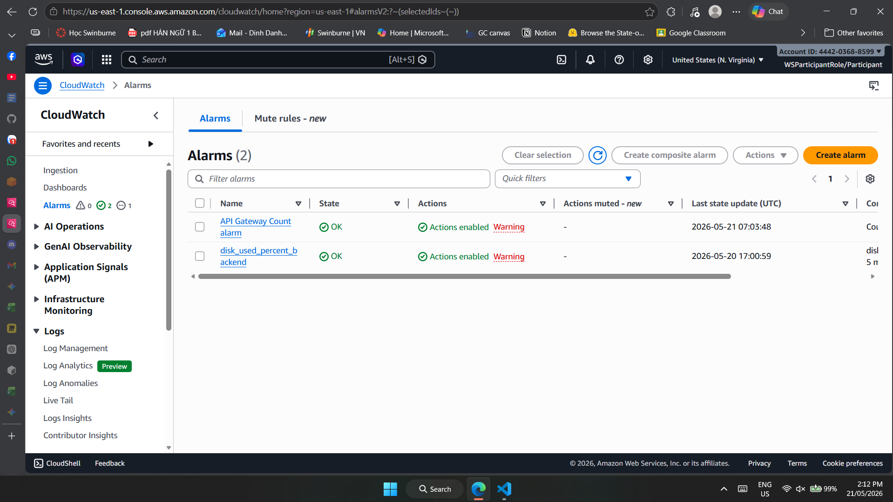

*Hình 24. Cấu hình CloudWatch alarm cho Week 6 monitoring control.*

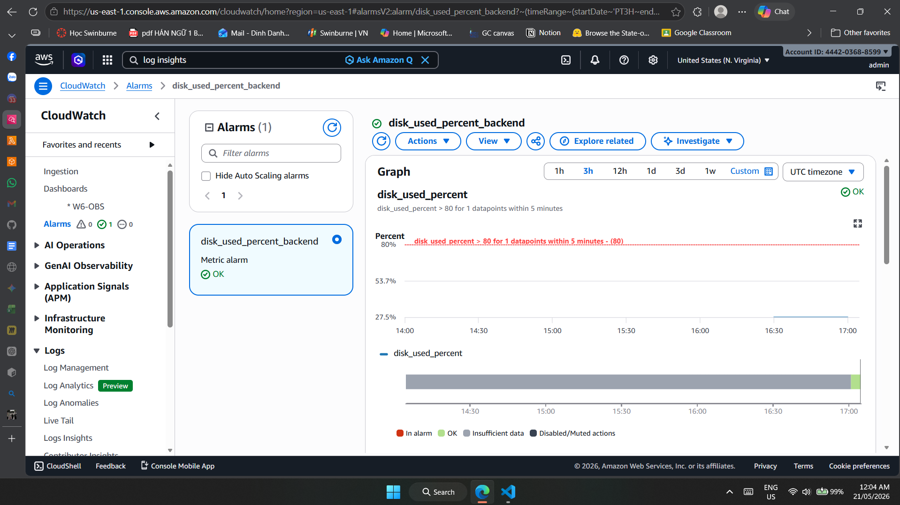

*Hình 25. Bằng chứng trạng thái CloudWatch alarm cho thấy alarm có thể được đánh giá từ dashboard.*

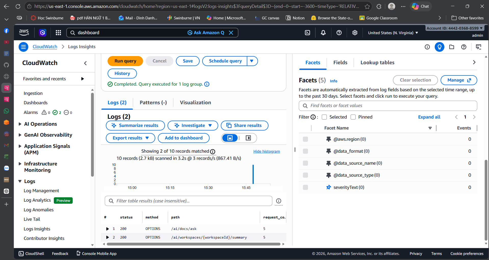

*Hình 26. Kết quả query CloudWatch Logs Insights dùng để phân tích API Gateway access log theo method, path và status.*

## MH-SEC — Bảo Mật Tự Phục Hồi

Kiểm soát bảo mật tự phục hồi của TaskIO W6 bảo vệ hệ thống khỏi truy cập quản trị public ngoài ý muốn. Lỗi cấu hình được chọn là Security Group ingress rule mở SSH ra internet. Đây là kiểu lỗi thực tế vì rule debug tạm thời rất dễ bị để quên sau khi troubleshooting.

### Blast Radius Paragraph

Phạm vi ảnh hưởng nếu không xử lý: rule SSH/RDP public sẽ mở bề mặt quản trị backend ra internet, khiến host liên tục bị scan và brute-force. Nếu kẻ tấn công chiếm được host, họ có thể di chuyển từ EC2 sang secret ứng dụng, logs, đường truy cập S3 và các đường mạng database/cache mà security group đó cho phép. Ngay cả khi ứng dụng vẫn healthy, một rule admin ingress bị quên sau troubleshooting có thể biến thành sự cố bảo mật rộng hơn ở workload. Self-healing guard giảm phạm vi ảnh hưởng bằng cách xóa ingress rule rủi ro ngay sau khi CloudTrail ghi nhận thay đổi.

Vòng phát hiện và xử lý được thiết kế theo event-driven pattern. CloudTrail ghi lại API call `AuthorizeSecurityGroupIngress` không an toàn, EventBridge match event, và Security Guard Lambda gọi `RevokeSecurityGroupIngress` để xóa public rule.

Phạm vi Security Guard cho full stack:

| Nhóm resource | Hành vi của guard |
|---|---|
| W6 test Security Group | Xử lý public SSH/RDP ingress ngay để tạo bằng chứng demo |
| Backend/API Security Groups | Xử lý `0.0.0.0/0` trên admin ports `22` và `3389`; giữ các app ports có chủ đích như `80`/`443` theo thiết kế ALB/API edge |
| ALB/WAF edge | Không tự động xóa rule public `80`/`443`; kiểm soát bằng WAF/ALB policy |
| Database/cache Security Groups | Xử lý mọi public ingress; nhóm này chỉ nên allow source từ app/security group |
| EFS/Backup/S3 | Security Guard không stop resource; rủi ro S3 exposure được xử lý bằng Block Public Access và bucket policy |
| Resource chưa triển khai trong W6 | Áp dụng cùng policy khi được triển khai và có `Application=TaskIO`; có thể thu hẹp automation bằng `SecurityGuardScope=true` |

Trong W6, chỉ test Security Group được cố ý tạo vi phạm. Với full stack, cùng self-healing rule này sẽ bảo vệ backend, database, cache và các security group hướng tới EFS khỏi public admin exposure ngoài ý muốn, đồng thời tránh làm gián đoạn các public edge resource hợp lệ.

```text
Vi phạm:
0.0.0.0/0 on TCP port 22

Hành động xử lý:
ec2:RevokeSecurityGroupIngress
```

Vòng demo:

1. Demo Security Group được cố ý mở `0.0.0.0/0` trên TCP port `22`.
2. EventBridge trigger Security Guard Lambda từ CloudTrail `AuthorizeSecurityGroupIngress` event.
3. Lambda gọi `RevokeSecurityGroupIngress`.
4. Public SSH rule bị xóa khỏi Security Group.
5. CloudTrail ghi lại `RevokeSecurityGroupIngress` event xử lý.

Control phòng ngừa bổ trợ là lớp phòng ngừa public/data exposure cho S3. Block Public Access cấp account cho S3 đã được bật, và W6 artifact bucket có deny policy để từ chối object upload không mã hóa. Test `PutObject` không mã hóa thất bại với `AccessDenied`, trong khi test `PutObject` có mã hóa thành công với `AES256` server-side encryption.

Security Guard Lambda và EventBridge rule gần như không tạo chi phí ở lưu lượng workshop vì chỉ chạy khi có security event. S3 Block Public Access và deny-unencrypted bucket policy là control miễn phí, nên chúng cải thiện baseline bảo mật mà không làm tăng rủi ro vượt `150 USD` cost cap tuần.

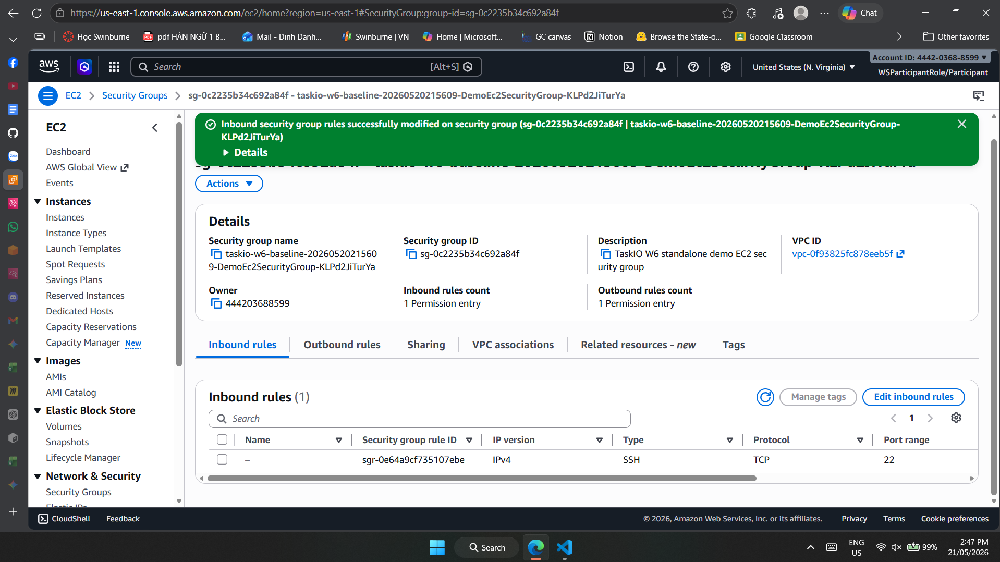

*Hình 27. Bằng chứng setup self-healing MH4 cho đường EventBridge -> Lambda security automation.*

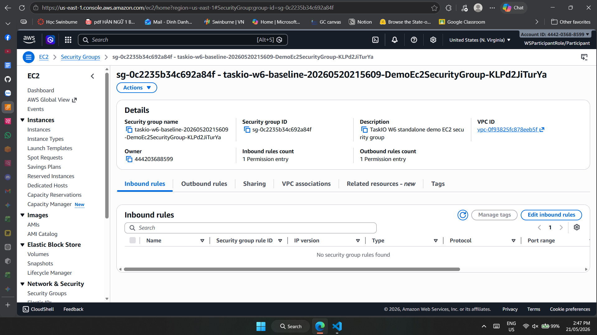

*Hình 28. Vi phạm Security Group trước khi xử lý, dùng để demo vòng bảo mật tự phục hồi.*

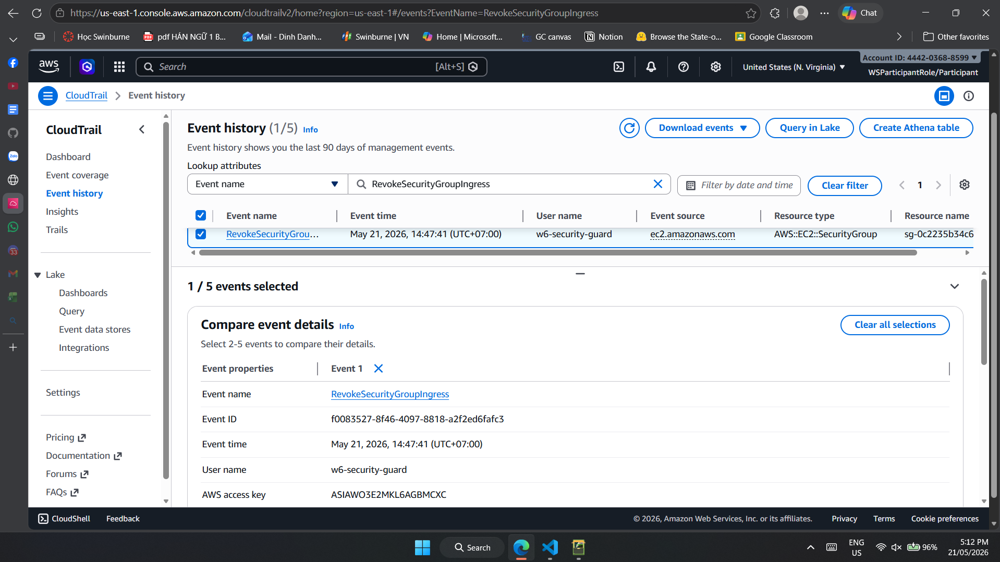

*Hình 29. Kết quả self-healing sau khi automation bảo mật xóa inbound rule rủi ro.*

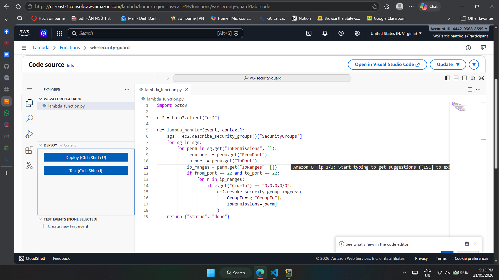

*Hình 30. Bằng chứng code/configuration của Security Guard Lambda cho logic xử lý.*

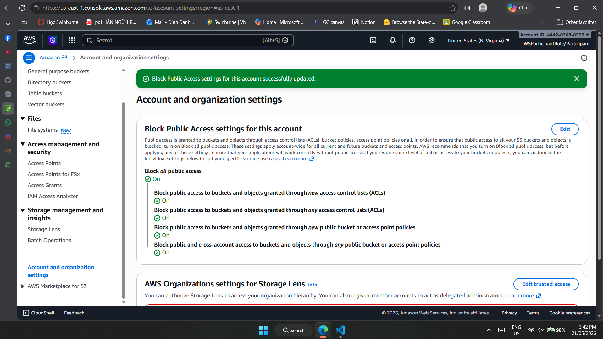

*Hình 31. Control phòng ngừa Block Public Access cấp account cho S3 được bật như guardrail bảo mật bổ trợ.*

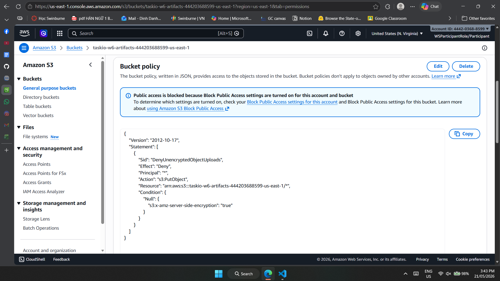

*Hình 32. Control phòng ngừa bằng S3 bucket policy deny upload không dùng server-side encryption.*

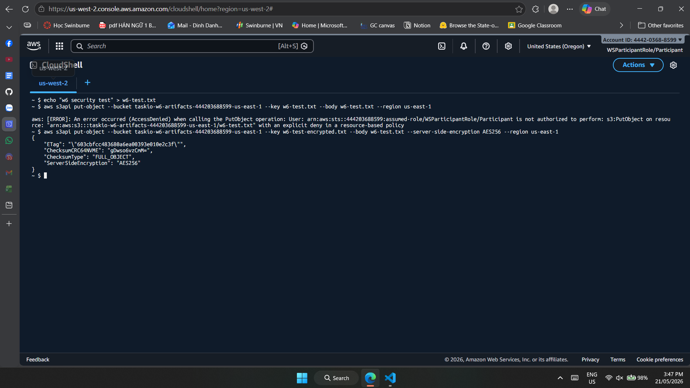

*Hình 33. Bằng chứng test upload S3 cho thấy control phòng ngừa chặn object upload không tuân thủ.*

## Bonus Stretch Goals

### Bonus 1 — Reflection: Wasteful -> Changed

Nhóm phát hiện khoản lãng phí lớn nhất không đến từ TaskIO W6 stack mà đến từ một OpenSearch Serverless vector collection `myproduct-kb` trong region `us-west-2`, thuộc stack `rag-w-bedrock-kb`. Cost Explorer cho thấy resource này tạo khoảng `12.97 USD` trong hai ngày qua `USW2-IndexingOCU` và `USW2-SearchOCU`, dù nó không phục vụ demo TaskIO. Nhóm đã kiểm tra ownership của resource, xác nhận collection không thuộc các stack `taskio-w6-*`, sau đó xóa CloudFormation-managed collection. Sau cleanup, `aws opensearchserverless list-collections --region us-west-2` trả về danh sách rỗng. Thay đổi này loại bỏ nguồn chi phí lớn nhất, củng cố chiến lược W6 tiết kiệm chi phí, và giúp account không tiếp tục bị charge OCU-hour ngoài phạm vi bài nộp.

### Bonus 2 — Phân Tích Break-Even RI / Savings Plans

Footprint compute W6 hiện tại chỉ có hai EC2 `t3.micro` ở `us-east-1a`: một backend EC2 đang chạy và một demo EC2 đang stopped. Hai EBS volumes hiện đều là `gp3` với `8 GiB`, `3000 IOPS` và `125 MiB/s`, nên nhóm không chọn gp2→gp3 migration làm bonus vì không còn gp2 volume thật để migrate.

Pricing API cho `Linux t3.micro` ở `US East (N. Virginia)` trả về On-Demand price là `0.0104 USD/hour`. Nếu cả hai instance chạy liên tục trong một tuần, EC2 compute cost chỉ khoảng:

```text
2 instances * 24 hours/day * 7 days * 0.0104 USD/hour = 3.49 USD/week
```

Một 1-year Standard Reserved Instance all-upfront cho `t3.micro` có upfront fee khoảng `53 USD`. Break-even so với On-Demand nếu workload chạy liên tục là:

```text
53 USD / 0.0104 USD/hour = ~5,096 hours
5,096 hours / 24 = ~212 days
```

Vì workload workshop W6 chỉ tồn tại khoảng một tuần và chi phí compute dự kiến thấp hơn rất nhiều so với mức cam kết 1 năm, nhóm quyết định không mua RI hoặc Savings Plan. Quyết định hợp lý hơn cho W6 là dùng On-Demand nhỏ nhất có thể, dừng demo EC2 khi không cần, giữ backend ở `t3.micro`, và không thêm managed service đắt tiền. Nếu TaskIO chuyển sang production với workload chạy ổn định trên cùng footprint trong ít nhất 7 tháng, lúc đó RI hoặc Compute Savings Plan mới đáng được xem xét.
